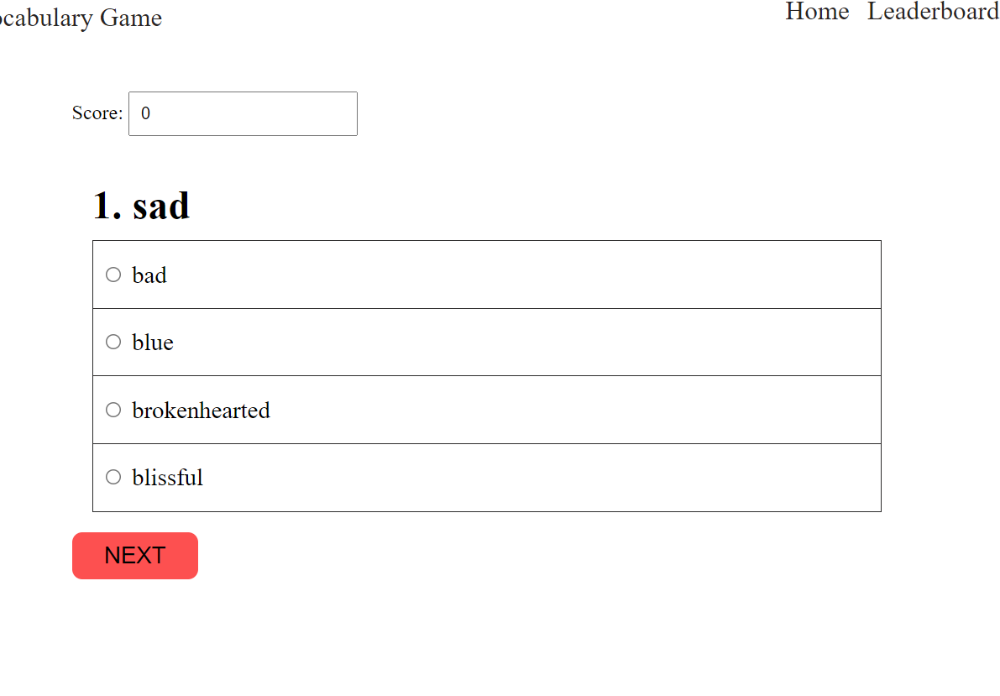

# Vocabulary Game

> A fun vocabulary game where you can test how you're doing and compare yourself with others in the leaderboard.

## Built With

- HTML
- CSS
- JavaScript
- [Meriam webster dictionary API](https://dictionaryapi.com/)
- [Leaderboard API](https://www.notion.so/microverse/Leaderboard-API-service-24c0c3c116974ac49488d4eb0267ade3)

## Live Demo

[Live Demo Link](https://wes-isaac.github.io/Vocabulary-game/)

## Getting Started

To get a local copy up and running follow these simple example steps.

Clone the repo to your local machine. Run this command

git clone https://github.com/Wes-Isaac/Vocabulary-game.git

cd Vocabulary-game

run the command 'npm install'

Next, run 'npm start' which will run the app in the development mode.

Open http://localhost:3000 to view it in the browser.

## Author

👤 **Yishak**

- GitHub: [Yishak ,Wes-Isaac](https://github.com/Wes-Isaac)
- LinkedIn: [@Yishak](https://www.linkedin.com/in/yishak-wesego-b404851a7/)

## 🤝 Contributing

Contributions, issues, and feature requests are welcome!

Feel free to check the [issues page](https://github.com/Wes-Isaac/To-do-list/issues).

## Show your support

Give a ⭐️ if you like this project!

## Acknowledgments

- Hat tip to anyone whose code was used
- Inspiration
- etc

## 📝 License

This project is [MIT](./MIT.md) licensed.